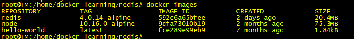
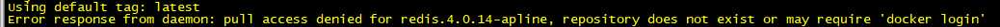

# Docker
Docker basic learning

> Docker 

- Docker 使用Google公司推出的Go语言进行开发的
- Docker 是Linux容器的一种封装，提供简单易用的容器使用接口。它是最流行的Linux容器
- Docker 将应用程序与程序的依赖，打包在一个文件里面。运作这个文件就会生成一个虚拟容器
- Docker 是一个开源的引擎，可以轻松的为任何应用创建一个轻量级的、可移植的、自给自足的容器。
> 什么是Docker镜像

- 就是把业务代码，可运行环境进行整体的打包

> 镜像分类

- 镜像分为本地镜像和中心镜像.中心镜像主要存放的是镜像仓库里面

> 容器是什么

- 容器本质上是进程,如nginx镜像，通过镜像启动一个nginx容器，其实就是在主机上启动一个nginx进程

- Docker images：它是一个可执行文件，包含了运行一个应用程序的操作系统配置和所有的库。它有多层叠在一起，并表示为单个对象。docker images 是通过docker file 来创建的
- Docker Container: 它是docker image 的一个运行实例。同一个docker image 可以有多个运行的container.


- 查看docker版本
```
docker version

root@FM:~# docker version
Client:
 Version:           18.09.6
 API version:       1.39
 Go version:        go1.10.8
 Git commit:        481bc77
 Built:             Sat May  4 02:36:00 2019
 OS/Arch:           linux/amd64
 Experimental:      false

Server: Docker Engine - Community
 Engine:
  Version:          18.09.6
  API version:      1.39 (minimum version 1.12)
  Go version:       go1.10.8
  Git commit:       481bc77
  Built:            Sat May  4 01:59:36 2019
  OS/Arch:          linux/amd64
  Experimental:     false
  ```

  ```
  root@FM:/home/docker_learning/redis# docker -v
  Docker version 18.09.6, build 481bc77
  ```

- 列出镜像
- 镜像ID是镜像的唯一标识，一个镜像可以对应多个标签
```
docker image ls
```

| 仓库名     |   标签     |        镜像ID     |       创建时间    |     所占用的空间|
| --- | --- | --- | --- | --- |
| REPOSITORY|          TAG           |      IMAGE ID |           CREATED       |      SIZE|
| redis      |         4.0.14-alpine|       d2664936e292|        6 days ago    |      35.7MB|
| node        |        10.16.0-alpine|      9dfa73010b19 |       3 weeks ago   |      75.3MB|
| hello-world  |       latest|              fce289e99eb9  |      6 months ago |       1.84kB|


- 查看镜像、容器、数据卷所占用的空间
```
docker system df
```

- 虚悬镜像(dangling image) : 仓库名、标签均为<none> 的镜像
docker image ls -f dangling=true

- 默认的docker image ls  列表中只会显示顶层镜像
- docker image ls -a 显示包括中间层镜像在内的所有镜像
docker image ls -a

- 列出部分镜像
docker iamges ls redis

- 删除本地镜像  docker image rm [选项] <镜像1>[...]

- 导出容器 docker export 容器名或容器ID > 导出的路径以及tar包的名字
- docker export e039d9c6da11 > ./redis:4.0.14-alpine.tar

- docker import : 丢弃了所有的历史记录和元数据信息，仅保存容器当时的快照状态。
- 在导入的时候重新制定标签等元数据信息。
- docker load: 将保存完整记录，体积较大

```
docker run  把镜像创建成容器

-d  把镜像创建成容器之后，把进程启动到后台，这个进程就相当于一直进行，容器的状态也一直是up的
-p  进行端口验证的时候,前面所以机子端口，后面是容器服务的端口
--restart=always  如果容器有异常只会重新启动一次
--name registry  创建这个容器的时候，起个名字，叫registry
-t 为容器重新分配一个伪输入终端
```


> 小案例 (启动一6379的redis容器)

- 编写linux-redis.sh 脚本
```
#! /bin/sh
if [ -x "$(command -v docker)" ]
then
    echo "[1] checking docker state ------------ [ok]"
else
    echo "install docker first, pls"
fi

echo "[2] start pull redis.4.0.14-apline"
# 从镜像仓库中拉取或者更新指定镜像
sudo docker pull "redis.4.0.14-apline"
# 查看镜像
sudo docker images
# 优雅停用指定的容器
sudo docker container stop globalredis
# 删除指定的容器
sudo docker rm globalredis
# 创建一个新的容器并运行一个命令
sudo docker run -d --name globalredis -p 6379:6379 -t redis:4.0.14-apline --requirepass "fb123456"
# 查看当前正在运行的的images实例
sudo docker ps
```
- 启动之后 docker images 查看

- 

- 如果报异常，如下所示，需要注册Docker ID  可去官网注册 <a>https://hub.docker.com</a>

- 
